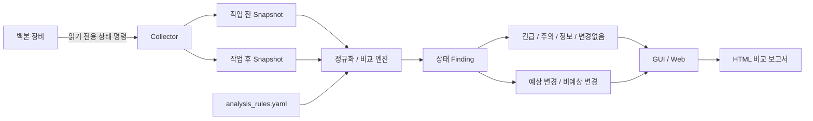

# 백본 변경 전·후 상태 검증

[](https://github.com/sebia1993/hpe-comware-change-validator/actions/workflows/pr-build.yml)

버전: `v0.9.0`

**HPE/Aruba 계열 백본 장비의 상태를 읽기 전용 명령으로 수집하고, 작업 전 기준 스냅샷과 작업 후 스냅샷을 비교해 링크·라우팅·이중화·하드웨어·리소스 변화를 분류하는 Windows 네트워크 운영 검증 도구입니다.**

단순히 `show` 명령 결과를 저장하는 데서 끝나지 않고, **작업 전후에 무엇이 달라졌는지, 그 변화가 계획된 것인지, 추가 확인이 필요한 위험 신호인지**를 운영자가 빠르게 판단할 수 있도록 설계했습니다.

> 실제 운영망의 IP, Hostname, 계정, 원본 로그와 장비 출력은 공개 저장소에 포함하지 않습니다. 문서와 샘플은 비식별 값만 사용합니다.

## 채용 검토자를 위한 읽는 순서

[포트폴리오 검토 안내](docs/PORTFOLIO_REVIEW_KO.md)에서 **설계 질문 → 실제 코드 → 실패 사례 테스트 → 장비 없는 재현 → 검증 한계** 순서로 확인할 수 있습니다. 아래 운영 설명과 함께 읽으면 기능 주장과 공개 근거를 대조할 수 있습니다.

## 한눈에 보기

| 항목 | 내용 |
|---|---|
| 목적 | 백본 변경 작업 전·후 상태 검증 |
| 수집 방식 | SSH 전용, 승인된 호스트 키, 읽기 전용 명령 |
| 주요 영역 | Interface, LACP, VLAN, STP, OSPF, VRRP, CPU, Memory, Power/Fan/Alarm, Log |
| 비교 방식 | 기준 스냅샷과 대상 스냅샷의 구조화 비교 |
| 결과 분류 | 긴급 / 주의 / 정보 / 변경없음 |
| 계획 변경 | 작업 단계별 `expected_changes`로 별도 표시 가능 |
| 접속 실패 | 명령별 실패로 증폭하지 않고 장비 연결 상태 하나로 정리 |
| 결과물 | Snapshot, 비교 결과, HTML 보고서, 안전 진단 보고서 |
| 실행 방식 | Windows GUI / 로컬 웹앱 |
| 장비 변경 | **없음 — 허용된 조회 명령만 접속 직전에 재검증** |
| 배포 | Windows 통합 ZIP, 최종 사용자 PC에 Python 설치 불필요 |

## 해결하려 한 운영 문제

백본 작업에서는 작업 자체보다 **작업 후 정상 복구를 빠짐없이 확인하는 과정**이 중요합니다. 여러 장비에서 수십 개의 상태 명령을 수동으로 다시 실행하고 작업 전 결과와 비교하면 다음 문제가 생깁니다.

- Interface Down이나 LACP 멤버 감소를 사람이 화면으로 놓칠 수 있음
- OSPF Neighbor가 `Full`에서 벗어난 상태를 뒤늦게 발견할 수 있음
- VRRP Master/Backup 역할 이동이 계획된 절체인지 비정상 변화인지 구분이 필요함
- CPU/Memory가 임계값을 넘었는지 작업 전후 숫자를 직접 비교해야 함
- Power/Fan/Alarm과 최근 로그를 별도 명령으로 확인해야 함
- 장비 자체에 접속하지 못한 경우 모든 명령 실패가 반복 표시되어 실제 원인이 흐려질 수 있음
- 작업 단계상 의도된 OFF/복구 상태도 단순 diff만 보면 장애처럼 보일 수 있음
- 기준과 비교 시점의 시각·uptime 같은 변동값이 의미 없는 diff를 늘릴 수 있음

이 프로젝트는 **수집 → 정규화 → 상태 판정 → 예상 변경 구분 → 우선순위 정렬 → 보고서**를 하나의 흐름으로 자동화합니다.

## 핵심 설계 판단

| 운영 문제 | 설계 판단 |
|---|---|
| 작업 전후 수십 개 명령을 수동 비교 | Snapshot 단위로 결과를 저장하고 동일 장비·명령 ID 기준으로 자동 비교 |
| 시각·uptime 등 항상 바뀌는 값 | 변동성 높은 행을 정규화해 의미 없는 diff를 줄임 |
| 장비 접속 실패가 명령 수만큼 반복 표시 | `device_connectivity` 한 항목으로 통합하고 하위 명령 누락 경고를 억제 |
| Interface Down | 작업 계획에 없는 Down은 긴급 확인 대상으로 분류 |
| LACP Selected 멤버 감소 | 대역폭·이중화 저하 가능성을 별도 finding으로 분류 |
| OSPF Neighbor 상태 이탈 | `Full` 상태 이탈을 라우팅 위험 신호로 분리 |
| VRRP 역할 변화 | Master/Backup·priority 변화를 별도 항목으로 표시 |
| CPU/Memory 상태 | 고정 임계값을 코드에만 숨기지 않고 `analysis_rules.yaml`에서 관리 |
| 계획된 장비 OFF/복구 | 작업 단계·장비·명령·요약을 기준으로 `expected_changes` 처리 |
| 신규 위험 로그 | Down/Failure/Major Alarm 등 위험 키워드와 Warning/Error 계열을 구분 |
| 실제 운영정보 외부 공유 위험 | 안전 진단에서는 원본 대신 단계·건수·오류 코드 중심으로 기록하고 식별자를 마스킹 |

현재 기본 임계값은 CPU 50% 이상 주의 / 70% 이상 긴급, Memory FreeRatio 40% 이하 주의 / 30% 이하 긴급이며 `config/analysis_rules.yaml`에서 관리합니다.

상세 판정 기준은 [변경 검증 로직](docs/CHANGE_VALIDATION_LOGIC.md)을 참고하십시오.

## 동작 구조



구성요소별 책임은 [프로그램 구조](docs/ARCHITECTURE.md)에 정리되어 있습니다.

## 수집 범위

기본 명령 세트는 `config/commands.yaml`에서 관리합니다.

| 영역 | 대표 명령 | 확인 목적 |
|---|---|---|
| 기본 | `display version`, `display device` | OS/부팅/섀시·모듈 상태 |
| Interface | `display interface brief` | 포트 Up/Down 변화 |
| LACP | `display link-aggregation summary/verbose` | 집계 링크와 Selected 멤버 변화 |
| Switching | `display vlan`, `display stp brief` | VLAN/STP 상태 변화 |
| Routing | `display ospf peer`, `display ip routing-table protocol ospf` | OSPF 인접·경로 상태 |
| VRRP | `show vrrp` | Master/Backup과 가상 게이트웨이 역할 |
| Resource | `display cpu-usage`, `display memory` | CPU/Memory 임계 상태 |
| Hardware | `display power/fan/environment/alarm` | PSU/Fan/환경/알람 상태 |
| Log | `display logbuffer` | 작업 시점 신규 위험 로그 |

페이징 해제를 위해 세션 시작 시 `screen-length disable`을 사용할 수 있으며, 설정 변경 명령은 명령 목록에 포함하지 않습니다.

## 작업 전·후 검증 흐름

```text
1. 작업 전 수집
       ↓
2. 기준 Snapshot 확정
       ↓
3. 네트워크 작업 수행
       ↓
4. 작업 단계별 재수집
       ↓
5. 기준 Snapshot과 자동 비교
       ↓
6. 긴급/주의 항목 우선 확인
       ↓
7. 예상 변경 여부 확인
       ↓
8. 최종 복구 Snapshot 재검증
```

장비를 의도적으로 OFF하는 단계처럼 정상적인 변화가 예상되는 경우에는 `expected_changes` 규칙을 사용해 **“변화가 있다”와 “비정상이다”를 동일시하지 않도록** 설계했습니다.

## 실행 화면

저장소에는 비식별 샘플 데이터로 만든 화면 예시가 포함되어 있습니다.

### 장비 설정 / 수집


### 작업 전후 비교 결과


### 작업 단계 기록


## 실제 장비 없이 검증

GUI 또는 웹앱의 `샘플 검증 생성` 기능으로 실제 장비 접속 없이 Snapshot과 HTML 비교 보고서를 생성할 수 있습니다.

Mock 경계에서는 실제 운영정보를 사용하지 않고 다음과 같은 흐름을 재현할 수 있습니다.

- 정상 기준 상태
- 계획된 장비 OFF
- 장비 접속 실패의 단일 connectivity finding
- 작업 후 접속 복구
- 링크/라우팅/이중화 변화
- 비교 보고서 생성

실제 장비 검증과 자동 Mock 검증은 같은 증거 수준으로 표현하지 않습니다. 상세 범위는 [검증 보고서](docs/VALIDATION_REPORT.md)를 참고하십시오.

## 운영 안전 경계

- 명령은 Network 연결보다 먼저 중앙 안전 경계에서 NFKC 정규화·ASCII 제한·길이 제한·단일 명령 allowlist를 모두 통과해야 합니다.
- `display`, `show`, 제한된 페이징 제어 외 명령은 차단하며, 파이프·리디렉션·명령 연결·제어 문자·Unicode 우회 입력은 **접속 전에 실패**합니다.
- 장비 타입은 SSH 기반 `hp_comware`만 허용합니다. Telnet이나 알 수 없는 타입으로 안전 정책을 우회하지 않습니다.
- 별도 채널로 확인한 공개 호스트 키가 `config/known_hosts`에 없거나, 파일이 비어 있거나, 주석뿐이거나, 형식이 잘못되면 접속하지 않습니다.
- Netmiko는 strict host-key 검증을 사용하고 `ssh-rsa` 호스트 키와 사용자 공개키 인증 알고리즘을 모두 비활성화합니다.
- 장비 계정과 비밀번호를 저장소나 보고서에 기록하지 않습니다.
- 실제 `config/devices.yaml`은 로컬 전용이며 Git에 포함하지 않습니다.
- 실제 `config/known_hosts`도 로컬 신뢰 정보이므로 Git과 배포 ZIP에 포함하지 않습니다. 배포에는 설명용 `known_hosts.example`만 포함합니다.
- Windows/source 패키징은 공유 가능한 config 5개만 명시적으로 복사·허용하며 backup key, credentials, 로컬 inventory 대체명은 검증에서 거부합니다.
- 내부 IP, 실제 장비명, 고객/사이트명, 원본 운영 로그를 공개 문서에 넣지 않습니다.
- 진단 정보 공유 시 장비명, Hostname, IP, password, token, SNMP community 등 식별정보를 마스킹합니다.
- 장비 접속 실패는 다른 상태를 추정해서 채우지 않고 해당 시점의 관측 제한으로 처리합니다.
- 예상 변경 규칙은 실제 장애를 숨기는 용도가 아니라 작업 단계에서 **계획된 변화인지 확인하기 위한 보조 정보**로 사용합니다.

첫 실제 수집 전에는 [보안 정책과 호스트 키 등록 절차](SECURITY.md)를 따라 `gui\config\known_hosts`를 준비해야 합니다. `ssh-keyscan` 결과만으로 키를 신뢰하지 말고 장비 콘솔·관리 시스템 등 독립 채널의 fingerprint와 대조하십시오.

## 일반 사용자 다운로드

GitHub **Releases**에서 Windows 통합 ZIP을 사용합니다.

```text
backbone_state_tracker_v0.9.0_windows.zip
```

현재 형식 예시:

```text
backbone_state_tracker_v0.9.0_windows.zip
```

압축 해제 후:

```text
GUI:  gui\BackboneStateTracker.exe
Web:  web\start_webapp.cmd
주소: http://127.0.0.1:8765/
```

GitHub의 `Source code (zip)` / `Source code (tar.gz)`는 실행용 Windows 배포 파일이 아닙니다. ZIP, `.sha256.txt`, release manifest, CycloneDX SBOM은 서로 독립된 Release asset입니다. ZIP build provenance와 ZIP에 연결된 SBOM attestation도 함께 검증할 수 있습니다.

## 개발 및 검증

소스 실행과 테스트 준비는 [장비 없는 재현 안내](docs/PORTFOLIO_REVIEW_KO.md)를 참고하십시오. 테스트는 `backbone_state_tracker` 패키지명을 사용하므로 해당 디렉터리명으로 clone하고 부모 경로를 `PYTHONPATH`에 지정해야 합니다.

소스 실행:

```powershell
python -m pip install --require-hashes -r requirements-windows.lock
python app.py
```

기본 검증:

```powershell
$env:PYTHONPATH=(Split-Path (Get-Location) -Parent)
python -m unittest discover -s tests
python app.py --smoke-check
python webapp_launcher.py --smoke
```

Windows 통합 패키지:

```powershell
powershell -ExecutionPolicy Bypass -File .\tools\build_windows_exe.ps1
```

패키지 검증:

```powershell
python .\tools\verify_release_assets.py --zip <ZIP경로> --checksum <SHA파일> --manifest <매니페스트> --sbom <SBOM> --version v0.9.0 --repository sebia1993/hpe-comware-change-validator --application backbone_state_tracker --source-commit <40자리커밋>
```

개발 원칙은 [`DEVELOPMENT.md`](DEVELOPMENT.md), Release 운영 기준은 [`RELEASE_NOTES.md`](RELEASE_NOTES.md)를 참고하십시오.

## 문서

| 문서 | 용도 |
|---|---|
| [프로그램 구조](docs/ARCHITECTURE.md) | 수집 → Snapshot → Diff → Finding → Report 구조 |
| [변경 검증 로직](docs/CHANGE_VALIDATION_LOGIC.md) | Interface/LACP/OSPF/VRRP/리소스 및 expected change 판정 |
| [검증 보고서](docs/VALIDATION_REPORT.md) | 자동 검증과 운영 환경 검증의 증거 경계 |
| [사용자 가이드](docs/USER_GUIDE.md) | 설치·수집·비교·결과 확인 |
| [점검 명령 가이드](docs/COMMAND_GUIDE.md) | 명령별 의미와 확인 포인트 |
| [진단 모드](docs/DIAGNOSTIC_MODE_GUIDE.md) | Mock/안전 진단 사용법 |
| [오류 코드](docs/ERROR_CODE_CATALOG.md) | `BST-*` 오류 의미와 1차 조치 |
| [보안 정책](SECURITY.md) | 명령 안전 경계, 호스트 키 등록, CVE 보완통제와 검토 기한 |
| [변경 이력](CHANGELOG.md) | 버전별 상세 변경 기록 |

## 현재 범위

이 도구의 비교 결과는 운영자의 변경 검증을 보조하기 위한 것입니다.

- 특정 네트워크 장애의 원인을 자동 확정하지 않습니다.
- 모든 장비 OS/버전의 출력 형식을 자동으로 보장하지 않습니다.
- `expected_changes`에 등록되었다는 이유만으로 실제 네트워크 상태를 정상으로 단정하지 않습니다.
- CPU/Memory 임계값은 환경에 따라 조정이 필요할 수 있습니다.
- 실제 운영 환경에서는 조직의 변경관리·보안·장비 접근 정책을 우선합니다.
- 화면 자료와 자동 검증 결과는 합성/Mock/CI 근거이며 실제 운영 장비 검증이나 현장 성과 수치를 뜻하지 않습니다.

MIT License로 공개합니다. 자세한 조건은 [LICENSE](LICENSE)를 확인하십시오.
