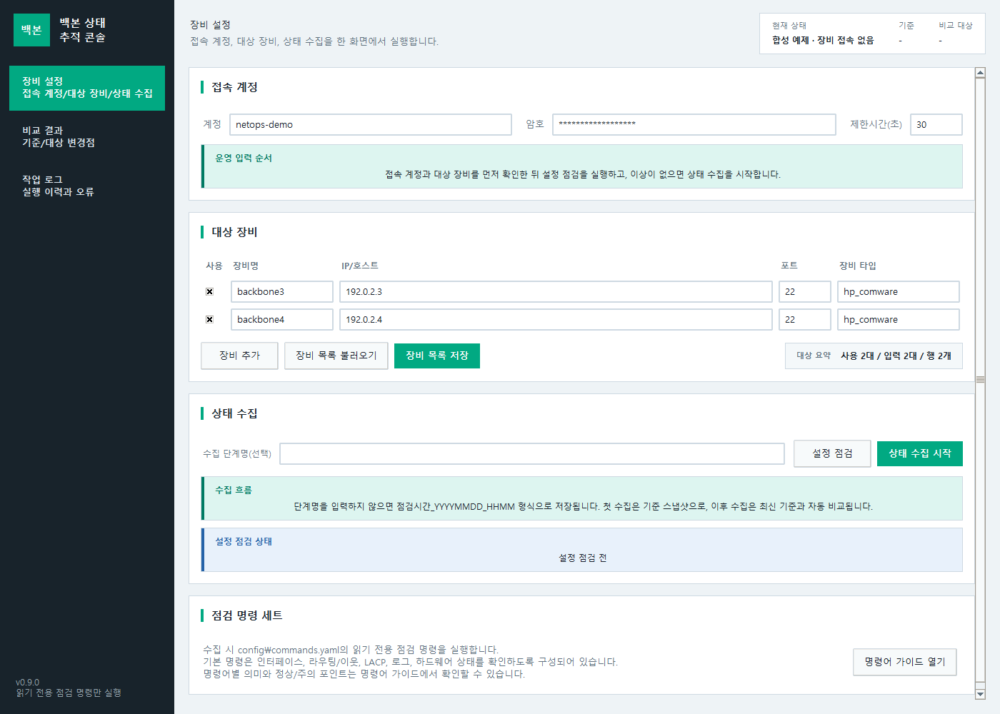
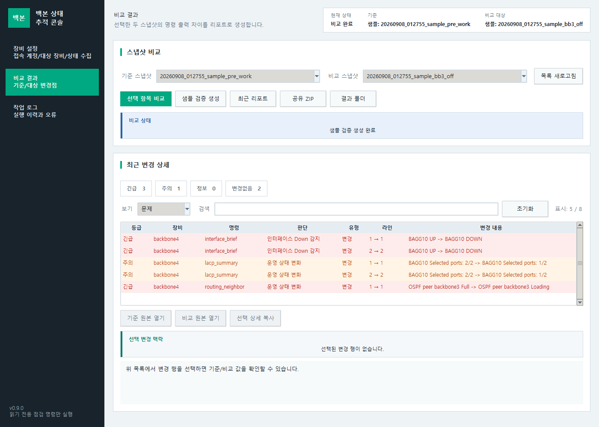
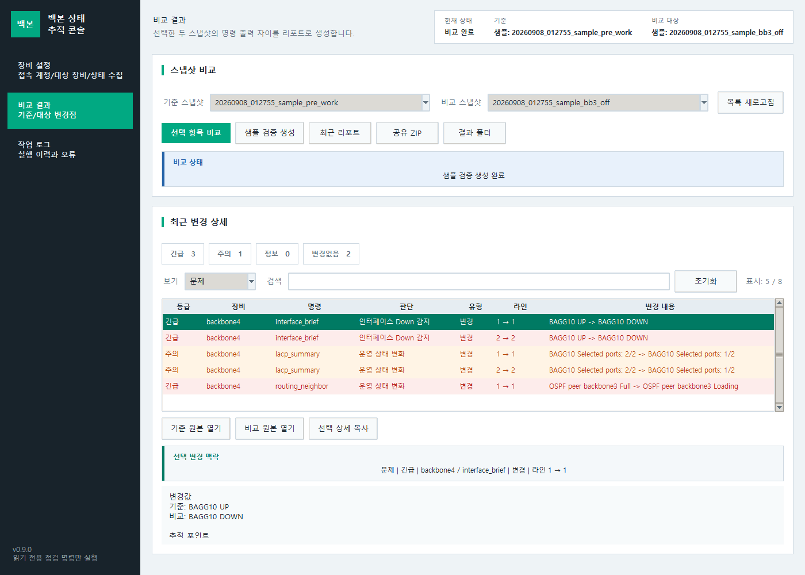
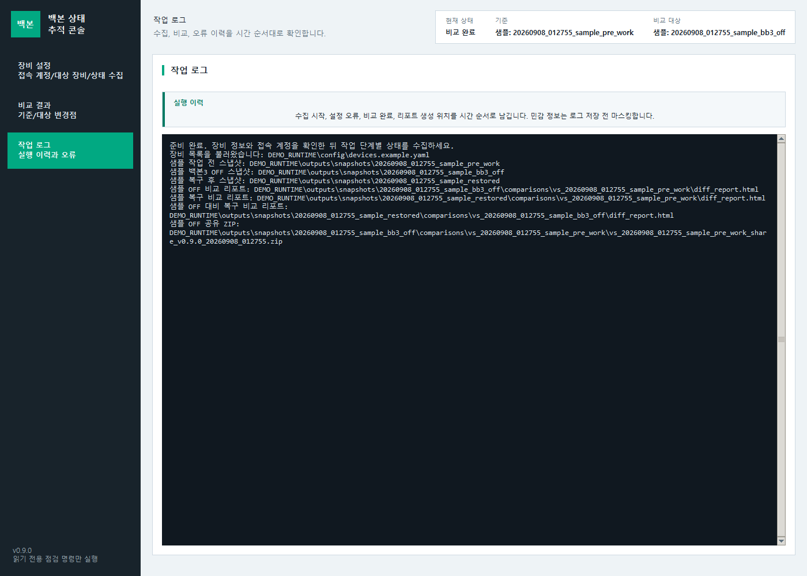

# 화면으로 따라가는 백본 변경 검증

현재 v0.9.0 Tk 앱에서 `샘플 검증 생성`을 실행해 캡처했다. 입력 화면은 합성 장비 2대이며, 비교·보고서·변경 행은 제품의 샘플 생성기와 DiffEngine이 계산했다. 장비 연결·상태 수집 버튼은 실행하지 않았다.

## 1. 대상과 기준 수집 단계 확인

- **행동:** 계정, 사용 대상, 장비명·주소·포트·장비 타입과 수집 단계를 확인한다.
- **읽을 값:** `backbone3/4`, `192.0.2.3/4`는 문서용 합성 장비다. 사용 2대와 입력 2대가 일치하는지 확인한다.
- **주의·다음 행동:** 실제 환경에서는 SSH 지문과 읽기 권한·명령 목록을 검토한 뒤 설정 점검을 진행한다. 장비 없이 둘러보려면 비교 결과의 `샘플 검증 생성`을 사용한다.

## 2. 기준·비교 대상·필터를 먼저 확인

- **행동:** 기준이 `sample_pre_work`, 비교 대상이 `sample_bb3_off`인지 확인한다.
- **읽을 값:** 긴급·주의·정보·변경없음 집계와 현재 `문제` 필터, 표시 행 수를 함께 읽는다.
- **주의·다음 행동:** 필터 때문에 보이지 않는 항목을 누락이나 정상으로 추정하지 않는다. 샘플의 OFF 상태는 합성 시나리오다. 실제 계획 변경 여부는 작업 단계·expected_changes 근거와 대조한다.

## 3. 한 행의 변경 근거를 확인

- **행동:** 변경 행을 선택하고 하단 상세를 `변경값`까지 스크롤해 장비·명령·판단·변경 전후 값을 연결해 읽는다.
- **읽을 값:** 예제는 backbone4의 interface 변화다. 선택 맥락과 상세 내용이 동일 항목을 가리키는지 확인한다. 상세 맨 위에는 문제 이유·판단 근거·권장 조치가 있으므로 위로 스크롤해 함께 읽는다.
- **주의·다음 행동:** 심각도만으로 장애 원인을 단정하지 않는다. 필요하면 기준 원본·비교 원본을 열고 [변경 검증 로직](CHANGE_VALIDATION_LOGIC.md)의 판정 범위와 대조한다.

## 4. 생성 파일과 작업 기록 확인

- **행동:** 작업 전·OFF·복구 스냅샷과 각 비교 HTML/공유 ZIP 생성 위치를 확인한다.
- **읽을 값:** `DEMO_RUNTIME`은 캡처 도구의 임시 폴더를 공개용 표시로 치환한 것이다. 나머지 파일명은 샘플 생성기의 실제 결과다.
- **주의·다음 행동:** 공유 ZIP에 운영 원문·개인정보가 없는지 별도로 검토한다. 생성 성공과 실제 장비 정상 복구는 다른 증거다. [사용자 가이드](USER_GUIDE.md)의 운영 절차와 [검증 보고서](VALIDATION_REPORT.md)의 한계를 함께 읽는다.

## 캡처 출처와 재현

- 앱 버전: `0.9.0`. 캡처 OS: Windows GitHub Actions/Python 3.12, 실제 Tk 창을 PrintWindow로 캡처.
- 캡처 소스 SHA: `0194f83fd3b7ed3a8166ebba6ac1150ab630716f`. [Windows 캡처 실행](https://github.com/sebia1993/hpe-comware-change-validator/actions/runs/34176682989).
- 전체 메타데이터와 PNG SHA-256: [capture-manifest.json](images/capture-manifest.json).
- 도구: [capture_usage_screenshots.py](../tools/capture_usage_screenshots.py), [창 캡처 helper](../tools/capture_windows.py), [Windows workflow](../.github/workflows/docs-screenshots.yml).
- 실제 경로: `create_mock_validation_artifacts`→SnapshotStore→DiffEngine→ReportWriter→GUI. 입력·시간·장비 상태는 합성 시나리오이며 실제 네트워크 호출은 차단한다.
- 기존 사용자 출력·설정을 읽거나 덮어쓰지 않도록 임시 runtime 폴더를 주입한다. Pillow는 캡처 workflow 전용 의존성이다.

Windows에서 잠금 의존성과 캡처용 Pillow 설치 후 `python tools/capture_usage_screenshots.py --output artifacts/docs-screenshots`로 재현한다. GUI에서 직접 체험하려면 `.\.venv\Scripts\python.exe app.py`로 열어 `비교 결과 → 샘플 검증 생성`을 선택한다. 기존 v0.8.56 이미지 대신 현재 샘플 실행 화면을 사용하며, 로컬 Windows 캡처는 1600×1050 이상 데스크톱이 필요하며, workflow는 일회용 runner만 1920×1080으로 설정한다. 제품 실행의 최소 해상도를 바꾸는 설정은 아니다. 제품 패키지·실장비 검증 근거는 기존 Windows CI와 현장 검증 기록에서 별도로 확인해야 한다.
